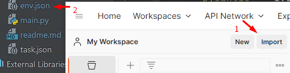

# Что нужно для запуска
* Python 3.10 или выше
* Packages:
  * ```SQLAlchemy``` 1.4.46
  * ```fastapi``` 0.89.1
  * ```psycopg2``` 2.9.5
  * ```pydantic``` 1.10.4

# Запуск
* Скачать [Postman](https://www.postman.com),установить.
* Скачать [Python](https://www.python.org/downloads/) v.3.10 или выше.
* Скачать базу данный [PostgreSQL](https://www.postgresql.org/download/) тестировалось на v.12+
* Клонируем проект с GitHub
* Открываем проект в ```PyCharm``` и редактируем данные БД (база данных: данные вшиты в код) как показано на рисунке ниже:


1. Название БД (URL начало)
2. Имя пользователя БД
3. Пароль БД
4. Имя хоста БД (```default: localhost```)
5. Порт БД (```default: 5432```)
6. Имя БД

* В открытом проекте, выбираем конфигурацию ```main``` 


* Запускаем проект


* Проект запущен, если в консоле (```Run```) ошибок нет, то покажет (в зависимости от конфигурации ```host:port```) что-то вроде этого: 


* Запускаем Postman, импортируем настройки (Картинка 1 - импортирует тесты, картинка 2 - импортирует ```environments```): 




* Если всё сделали правильно, то вы увидите примерно это:


* Так как проект у вас запущен, вы должны запустить сценарий как показано ниже:


* Нас интересует результат на последнем рисунке, ```Passed (161)``` - это количество тестов, которые прошли успешно, ```Failed (0)``` - количество тестов, которые прошли неудачно.
* Конец 

# Нюансы (Обязательно прочитать)
* Запускать только из скрипта текущего проекта, значения ```pm.environment.get('имя переменной окружения')``` если она подразумевалась как ```int``` теперь имеет вид ```parseInt(pm.environment.get('имя переменной окружения'))```
* Если убрать ```parseInt``` мы получим ошибки в тестах (программа отработает, но тесты постмана будут ругаться хоть и продолжать работу) напишет что ```'1' to deep equals 1``` пытаясь приравнивая стрингу к инту (может используется определённая версия опстмана и надо его просто обновить, но в моём случае стоит ласт версия постмана и он так не может)
* <span style="color:crimson">Важно!</span> Тестировалось на ```port=80```